## Procedure

The protocol for running an agarose gel has been described briefly in the following sections:

1. **Agarose Gel Preparation**

      

   1. Mix the agarose powder with electrophoresis buffer, TAE or TBE to the required concentration. Heat the mixture in a microwave oven to melt it.
   2. The agarose percentage used depends on the size of the fragments to be settled. The agarose gels are normally in the range of 0.2 – 3.0%. Low agarose concentrations are used to
resolve large DNA fragments, while high agarose concentrations allow the separation of
small DNA fragments.
   3. Once the mixture is cooled, add EtBr to the gel to facilitate visualization of DNA after electrophoresis. Pour it into a casting tray with a sample comb inserted on it. Allow the gel to solidify at room temperature. 
   
   

      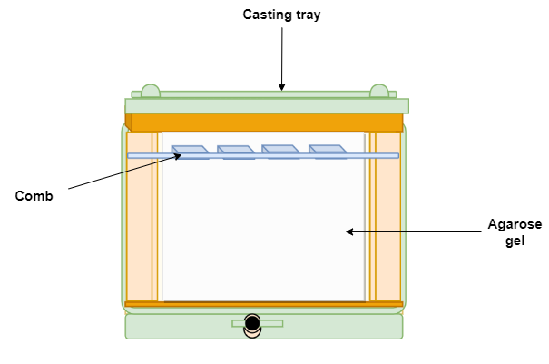
       

   4. After the solidification of the gel, remove the comb gently without ripping the bottom of the wells. There will be formation of wells on the gel.
   5. Insert the gel in a plastic tray horizontally into the electrophoresis chamber and pour the electrophoresis buffer sufficiently to immerse the gel with the buffer.

      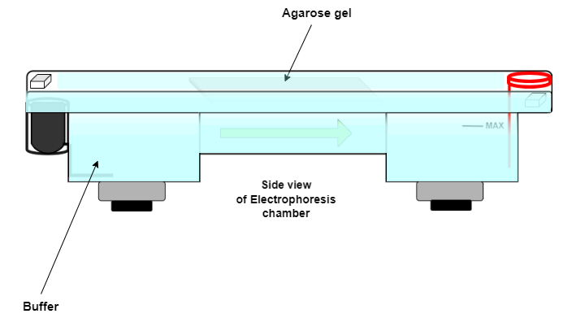
       

2. **Sample preparation**

     1. Mix the sample containing DNA with the loading buffer in particular concentrations and then pipette it into the sample wells.  

     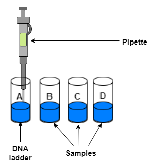

     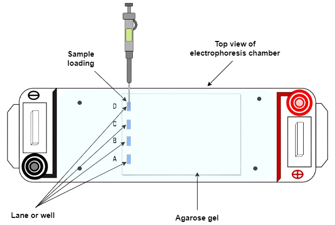
     

 <!--div align="center">
     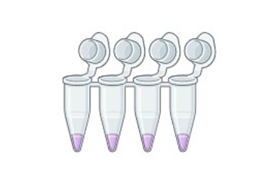
    </div-->

<!--

     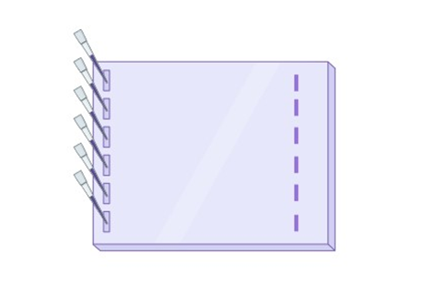
    </div-->

    

3. **Running the agarose gel**

  

   1. Once the samples has been loaded on the gel, place the lid and power leads on the apparatus, and finally set the voltage or current. Confirm the current flow by observing bubbles coming off the electrodes.
   2. The positive electrode is usually colored red, owing to its negative charge whereas the negative electrode is colored black. DNA migrates from the negative electrode to the positive electrode. 

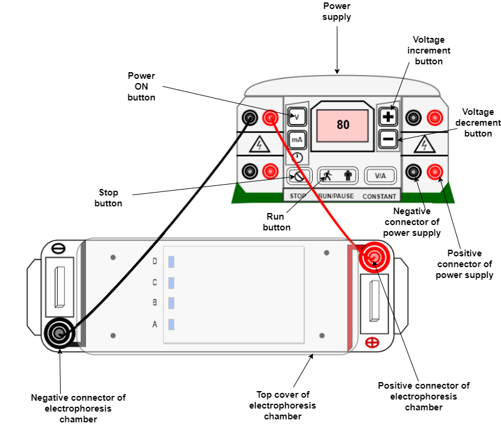

   <!--div align="center">
    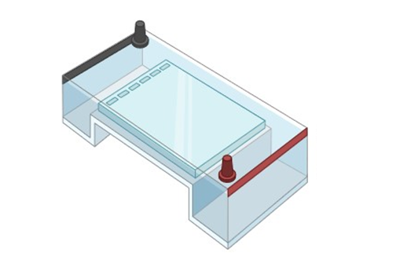
   </div-->
   
   
   3. The distance DNA has migrated in the gel can be visually observed by monitoring the migration of the tracking dyes such as bromophenol blue and xylene cyanol dyes.  

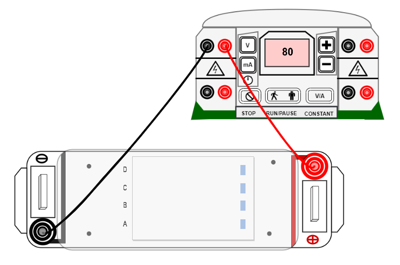

<!--div align="center">
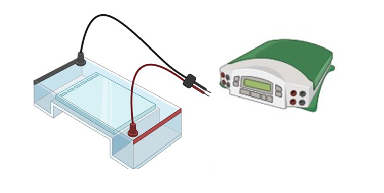
</div-->

4. **Visualization under UV light**

   1. After the gel is run, it is examined under UV light. The DNA bands can be visualized due
to the increase in fluorescence of the ethidium bromide upon binding to the DNA.

     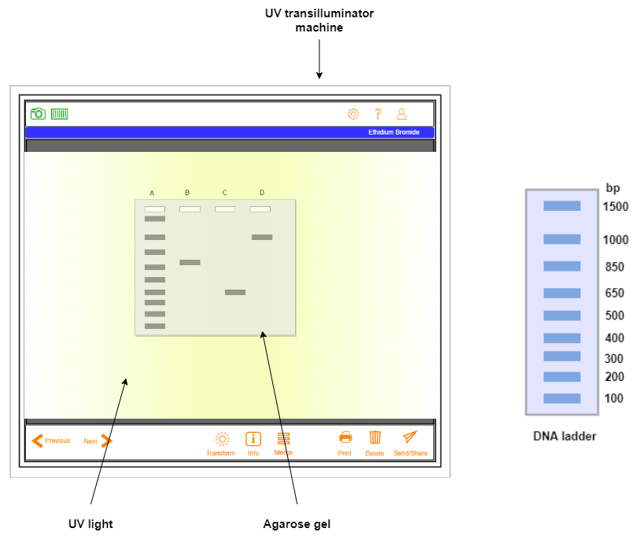
    

 <!--div align="center">
     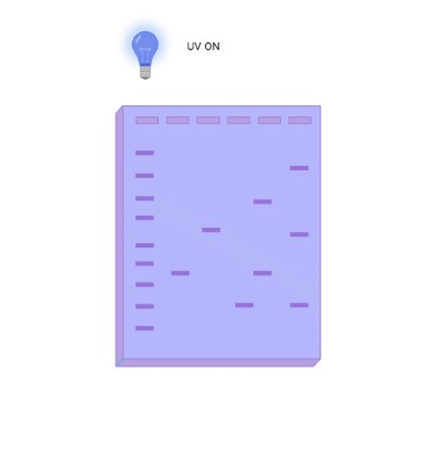
    
