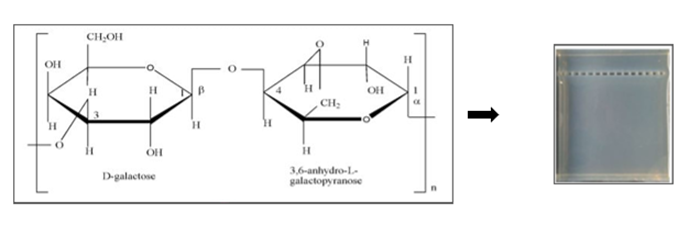

## Objective 

Agarose gel electrophoresis is used to resolve DNA fragments on the basis of their molecular weight on an agarose gel. The smaller-sized fragments migrate faster than larger ones; the distance migrated on the gel varies inversely with the logarithm of the molecular weight. In this experiment, we have three main objectives listed as follows:
1. Preparation of an agarose gel
2. Running an agarose gel 
3. Visualization of DNA 

## Theory

Gel electrophoresis is the standard lab procedure for separating DNA by size (length is measured by base pairs) for visualization and purification. It is one of the most widely-used techniques in biochemistry and molecular biology. Agarose is a linear polymer composed of alternative residues of D-galactose and 3,6-anhydro-L-galactopyranose joined by α (1→3) and β (1→4) glycosidic linkages as shown in the figure below. It is extracted and purified from seaweed (red algae).. Agarose forms a gel matrix of agarose molecules which has channels and pores through which molecules are able to pass. 

 

Electrophoresis is based on the principle of utilizing an electric field for the separation of DNA, RNA or proteins on the basis of their molecular size and charge. Deoxyribonucleic acid (DNA) is a negatively charged molecule due to the presence of phosphate groups in the backbone. Electrophoresis uses an electrical field to move the negatively charged DNA through an agarose gel matrix toward a positive electrode. The smaller DNA fragments migrate through the gel more quickly as compared to the larger ones. Thus, the approximate length of a DNA fragment can be determined by running it on an agarose gel alongside a DNA ladder (a mixture of DNA fragments of known lengths).

The electrophoretic migration rate of DNA through agarose gel depends on various factors such as the size of DNA molecules, concentration of agarose gel, voltage applied, conformation of DNA, and the buffer used for electrophoresis. The concentration or percentage of agarose defines the pore size of the gel, hence the size of the molecules that pass through. For example, the higher the percentage of agarose, the smaller the pore size, thus smaller molecules will be able to migrate. Several buffers are used for agarose gel electrophoresis, but the most common are: Tris-acetate EDTA buffer (TAE) and Tris-borate EDTA buffer (TBE). The speed of migration through a gel is also determined through voltage gradient, that is the voltage between the two electrodes. The required voltage can be calculated using the simple equation:

E=V/d

where E is the field strength, V the voltage and d the distance in cm between electrodes. Gel electrophoresis is affected by constant voltage, power, and current on the system. It utilizes the principles of resistance and heat to separate nucleic acid based on their size and charge. Resistance is affected by factors such as buffer conductivity, temperature, and gel properties. Heat generation in gel electrophoresis is directly proportional to power consumption and is influenced by buffer conductivity, applied voltage, and resistance.
The following equations, derived from Ohm’s Law, may be used to express the relationship between voltage (V), current (I), and resistance (R), all of which can influence results of electrophoresis.

Voltage = current x resistance, or V = I x R

Since DNA is colourless, the loaded sample need to be tracked. This is achieved by using a loading dye solution which consists of bromophenol blue. Finally, to visualize DNA, agarose gels are usually stained with ethidium bromide (EtBr), a fluorescent dye which intercalates between stacked base pairs of nucleotides and, in this environment, fluoresces when excited with ultraviolet light. A DNA and RNA size markers contain a mixture of DNA (or RNA) fragments of known length, making them suitable for estimating the fragment length of concurrently run samples.

#### Materials Required:
- Casting tray
- Well combs
- Voltage source
- Gel box
- UV light source
- Microwave

#### Reagents required:
- TAE 
- Agarose
- Ethidium bromide (EtBr)
- 6X gel loading buffer,
- DNA sample,
- DNA ladder
